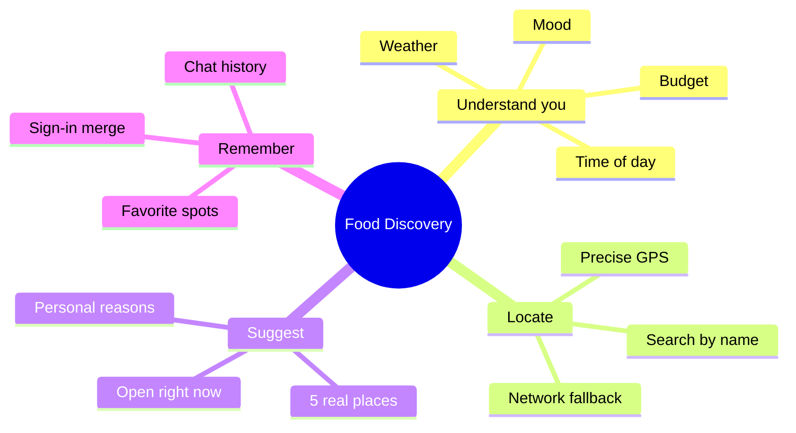

<div align="center">


# 🍜 Food Discovery Assistant

### *"What should I eat today?" — answered in 3 seconds.*

**The first AI food assistant for Vietnam that actually gets you.**
Tell it your mood, set your budget, get 5 real places nearby — each with a reason why it fits.

[](https://github.com/tvtdev94/food-discovery)
[](LICENSE)
[](https://github.com/tvtdev94/food-discovery)

[Features](#-key-features) • [Demo](#-demo) • [Quick Start](#-quick-start)

</div>

---

## ✨ Why this app?

> *"What's for lunch?" — the most exhausting question of the day.*

Google Maps gives you **a list of places**. Food Discovery gives you **a decision**.

| The old pain | Our way |
|---|---|
| Too many options → choice paralysis | **5 picks** filtered by AI for your context |
| Generic reviews | **Personal reasons**: it's raining → spots with covered seating |
| No clue if a place is open | Built-in **real opening hours** |
| Broken Vietnamese UX | **VI-first**: understands "I'm starving", "tired of rice" |

<div align="center">


</div>

---

## 🌟 Key features

<table>
<tr>
<td width="50%" valign="top">

### 🧠 Context-aware
The AI checks your **location, weather, and time of day** before suggesting. Rainy? Hungry? Late lunch? Every pick has its reason.

### ⚡ Instant answers
Watch the AI think live — no waiting. Words stream onto the screen as they're generated.

### 📍 Accurate location
GPS, search by district or street name, or auto-detect via network — we always know where to look.

</td>
<td width="50%" valign="top">

### 💾 Never lose your data
Chat as a guest → sign in → your history **auto-merges**. Pick up right where you left off.

### ❤️ Save what you love
Star the spots that match your taste. Next time you ask "what should I eat?", the bot leans into your style.

### 🇻🇳 Truly Vietnamese
The bot speaks warm, idiomatic Vietnamese. Hand-crafted — not machine-translated.

</td>
</tr>
</table>

---

## 🎯 Demo

<div align="center">


</div>

> 🧑 **You:** *"Starving, near Bach Khoa University, under 50k"*
>
> 🤖 **Bot:** *"Got you 🍜 Here are 5 spots — all under 50k, 5-min walk from the Parabol gate:*
> *1. **Phở Thìn — 38k** — packed with students right now, clean broth*
> *2. **Bún chả Tuyết — 45k** — open 11am–2pm, quick in and out*
> *3. ..."*

---

## 🗺️ What this app does



---

## 🚀 Quick start

### Requirements
- Node.js **>= 20**
- pnpm **>= 9**
- Free accounts: [Supabase](https://supabase.com) · [Upstash](https://upstash.com) · [OpenAI](https://platform.openai.com) · [Google Cloud](https://console.cloud.google.com)

### Run in 3 steps

```bash
# 1. Clone & install
git clone https://github.com/tvtdev94/food-discovery.git
cd food-discovery
pnpm install

# 2. Create .env.local from the template, fill in the required keys
cp .env.example .env.local

# 3. Run
pnpm dev
```

Open `http://localhost:3000` → ask *"what should I eat for lunch?"* 🎉

> 📖 Detailed setup (Supabase migration, env vars, Vercel deploy) lives in the `docs/` folder.

---

## 📝 License

MIT © [tvtdev94](https://github.com/tvtdev94)

---

<div align="center">

**Built with ❤️ in Vietnam — for everyone tired of saying "anything works"**

</div>
