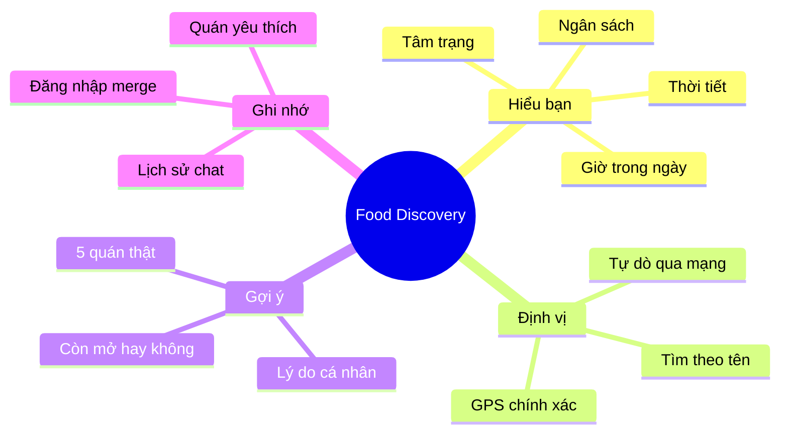

<div align="center">


# 🍜 Food Discovery Assistant

### *"Hôm nay ăn gì?" — Trả lời trong 3 giây.*

**Trợ lý AI gợi ý ăn uống Việt Nam đầu tiên hiểu bạn thật sự.**
Nói tâm trạng — chọn ngân sách — nhận về 5 quán thật, gần bạn, kèm lý do tại sao phù hợp.

[](https://github.com/tvtdev94/food-discovery)
[](LICENSE)
[](https://github.com/tvtdev94/food-discovery)

[Tính năng](#-tính-năng-nổi-bật) • [Demo](#-demo) • [Cài đặt](#-cài-đặt-nhanh) • [Roadmap](#-roadmap)

</div>

---

## ✨ Tại sao có app này?

> *"Trưa nay ăn gì?" — câu hỏi tốn năng lượng nhất trong ngày.*

Google Maps cho bạn **danh sách quán**. Food Discovery cho bạn **một quyết định**.

| Vấn đề cũ | Cách của chúng tôi |
|---|---|
| Quá nhiều quán → tê liệt | **5 gợi ý** đã được AI lọc theo bối cảnh |
| Review chung chung | **Lý do cá nhân hoá**: trời mưa → quán có mái che |
| Không biết quán nào còn mở | Tích hợp **giờ mở thực tế** |
| Tiếng Việt rời rạc | **VI-first**: hiểu "đói lắm rồi", "chán cơm" |

<div align="center">


</div>

---

## 🌟 Tính năng nổi bật

<table>
<tr>
<td width="50%" valign="top">

### 🧠 Hiểu bạn theo bối cảnh
AI đọc **vị trí + thời tiết + giờ trong ngày** trước khi gợi ý. Trời mưa? Đói? Buổi sáng? Mỗi gợi ý đều có lý do riêng.

### ⚡ Trả lời tức thì
Nhìn AI suy nghĩ live — không chờ. Streaming từng câu chữ ra màn hình.

### 📍 Vị trí chính xác
GPS, tìm theo tên quận/đường, hoặc tự dò qua mạng — luôn có cách định vị bạn.

</td>
<td width="50%" valign="top">

### 💾 Không mất dữ liệu
Chat khách → đăng nhập → lịch sử **tự động merge**. Không phải chat lại từ đầu.

### ❤️ Lưu quán yêu thích
Đánh dấu quán hợp gu. Lần sau hỏi "ăn gì?", bot ưu tiên gợi ý phong cách bạn thích.

### 🇻🇳 Viết bằng tiếng Việt thật
Bot nói chuyện ấm áp, hiểu slang. Không dịch máy — viết tay từng dòng.

</td>
</tr>
</table>

---

## 🎯 Demo

<div align="center">


</div>

> 🧑 **Bạn:** *"Đói lắm, gần Bách Khoa, dưới 50k thôi"*
>
> 🤖 **Bot:** *"Hiểu rồi 🍜 Mình chọn 5 quán — đều dưới 50k, đi bộ 5 phút từ cổng Parabol:*
> *1. **Phở Thìn — 38k** — đông sinh viên giờ này, nước trong*
> *2. **Bún chả Tuyết — 45k** — mở 11h-14h, ăn lẹ kịp giờ học*
> *3. ..."*

---

## 🗺️ App làm được gì?



---

## 🚀 Cài đặt nhanh

### Yêu cầu
- Node.js **>= 20**
- pnpm **>= 9**
- Tài khoản free: [Supabase](https://supabase.com) · [Upstash](https://upstash.com) · [OpenAI](https://platform.openai.com) · [Google Cloud](https://console.cloud.google.com)

### Chạy 3 bước

```bash
# 1. Clone & install
git clone https://github.com/tvtdev94/food-discovery.git
cd food-discovery
pnpm install

# 2. Tạo .env.local từ template, điền các key cần thiết
cp .env.example .env.local

# 3. Chạy
pnpm dev
```

Mở `http://localhost:3000` → hỏi *"trưa nay ăn gì?"* 🎉

> 📖 Hướng dẫn chi tiết (Supabase migration, các biến môi trường, deploy Vercel) có trong thư mục `docs/`.

---

## 📊 Roadmap

- [x] **MVP** — Chat + 5 gợi ý + favorites + history + đăng nhập
- [x] **Pre-warm cache** — Tốc độ phản hồi nhanh hơn
- [x] **Eval suite** — 30 câu hỏi tiếng Việt kiểm tra chất lượng
- [ ] **Cá nhân hoá sâu** — Học từ favorites + history
- [ ] **Đặt cùng nhóm** — "4 người ăn gì cùng?"
- [ ] **Đặt bàn online** — Tích hợp Foody / Now / Loship
- [ ] **PWA + offline** — Xem favorites không cần mạng
- [ ] **Đa ngôn ngữ** — EN / JA cho khách du lịch

---

## 🤝 Đóng góp

PRs welcome! Trước khi gửi:

1. Fork repo & tạo branch: `git checkout -b feat/your-feature`
2. Commit theo [Conventional Commits](https://www.conventionalcommits.org/)
3. Mở PR

---

## 📝 License

MIT © [tvtdev94](https://github.com/tvtdev94)

---

<div align="center">

**Built with ❤️ in Vietnam — for everyone tired of saying "ăn gì cũng được"**

</div>
