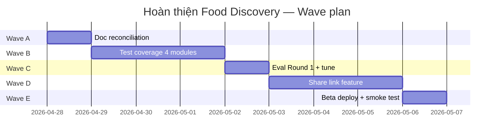

# Brainstorm Report — Food Discovery: Hoàn thiện sau MVP

**Date:** 2026-04-28 | **Status:** Decision-locked | **Next:** /ck:plan → /cook

---

## 1. Bối cảnh

User hỏi: *"với những gì đang có, cần gì để hoàn thiện hơn"*. Mục tiêu chốt:
- **Production-ready** (fix critical + security)
- **Test coverage + Eval** (validate AI quality)
- **Share link feature** (public read-only snapshot)
- **Bỏ map view** (tốn $$, deferred)
- Scale: **Beta nhỏ 10-100 user**
- Timeline: chưa cứng

---

## 2. Hiện trạng thực tế (≠ roadmap.md)

`docs/development-roadmap.md` ghi 5 critical + 6 high-priority issue chưa fix → **sai**. Sau khi đọc code:

| Issue | Roadmap nói | Thực tế trong code |
|---|---|---|
| C1 `recs_delta` double-encoded | ❌ | ✅ Fix `pass2-recs-structured.ts:116` |
| C2 Pass-2 wrong API shape | ❌ | ✅ Fix dùng `text:{format}` |
| C3 Open redirect | ❌ | ✅ `safeNext` apply ở callback |
| C4 device_id hijack | ❌ | ✅ Cookie-only + match check |
| C5 ADMIN_KEY default | ❌ | ✅ `.min(16)` required, no default |
| H1 Timeout location fetch | ❌ | ✅ AbortController ở nominatim + ip-geolocate |
| H2 Health endpoint leak | ❌ | ✅ Return ok/error only, log server-side |
| H3 Geocode IP+session limit | ❌ | ✅ Both checks ở `/location/search` |
| H4 `/location/ip` rate limit | ❌ | ✅ `ratelimitIpGeo` apply |
| H5 Favorites N+1 | ❌ | ✅ Zustand store `fetchOnce` |
| H6 Nested button | ❌ | ✅ `role="button"` thay <button> |
| H7 Chat AbortController | ✅ | ✅ Đã ghi nhận |

**Kết luận:** Bug fix đã xong từ trước, doc chưa sync.

---

## 3. Khoảng trống thật (gap thực sự)

### A. Doc Reconciliation (1-2h)
- `development-roadmap.md` cần đánh dấu C1-C5, H1-H7 là DONE
- `project-changelog.md` chưa có entry cho các fix này
- `codebase-summary.md` còn nhắc `responses-runner.ts (390 LOC)` — file này đã split thành 6 module trong `lib/chat/runner/`

### B. Test Coverage (2-3 ngày)
Modules chưa có test (per roadmap §9b.3):
- `lib/chat/runner/runner.ts` (orchestrator) + 5 module con đã có test 1 phần (pass1-tool-loop, pass2-text-stream, pass2-recs-structured) — cần lấp orchestrator + speculative-fetch
- `lib/chat/persist-turn.ts` — fire-and-forget DB writes, dễ regress
- `lib/chat/load-history.ts` — RLS-gated reads
- `lib/auth/resolve-identity.ts` — auth.uid() OR device_id
- `lib/location/ip-geolocate.ts` — IP lookup + cache

**Mục tiêu:** vitest pass ≥160 test (149 hiện tại + ~15 mới); coverage 80%+ ở chat pipeline + auth.

### C. Eval Round 1 (1 ngày)
- `evals/run-evals.mjs` chạy 30 VI queries → JSON results
- Manual grade: grounded (Y/N), relevance (1-5), tone (1-5)
- Pass criteria: grounded 30/30, relevance avg ≥4.0, tone avg ≥4.0
- Nếu fail → tinh chỉnh `persona-prompt-v2.ts` + run Round 2

### D. Share Link Feature (2-3 ngày) — **chốt: public read-only snapshot**
- DB: bảng mới `shared_recommendations(short_id PK text, owner_key, message_id, snapshot jsonb, created_at, expires_at?)` + RLS deny-all (chỉ service-role insert; public read qua route)
- Migration: `20260428000000_shared_recommendations.sql`
- Server route: `POST /api/share` từ message_id → tạo short_id (8-char base62, collision retry); `GET /s/[shortId]` → public page
- UI nút "Chia sẻ" trên `assistant-message.tsx` khi đã có recommendations → mở Sheet hiển thị link + copy button
- Page `/s/[shortId]` (Server Component): render giống message thread nhưng read-only, không composer, no auth required, no GPS
- OG meta tags cho preview share Facebook/Zalo
- Rate limit: 5 shares/h/owner

### E. Beta Deploy Prep (~1 ngày)
- Vercel project link + env vars production
- Sentry DSN verify (server + client)
- Admin dashboard `/admin/stats` smoke test
- Domain + HTTPS
- Health check uptime monitor (cronitor/uptimerobot)

---

## 4. Phân tích phương án Share Link

| Approach | Pros | Cons | Verdict |
|---|---|---|---|
| **Public snapshot** ✅ chọn | Friction = 0, viral, no auth | Không update khi gốc đổi (OK — snapshot là feature) | Best UX |
| Auth-required | Private, control truy cập | Friction cao, không lan tỏa | Không phù hợp viral |
| Deep link prompt | Đơn giản nhất | Kết quả khác (cache/time) → confusing | Mất giá trị share |

**Quyết định:** Public read-only snapshot. Snapshot đóng băng để link không vỡ.

---

## 5. Đề xuất Roadmap

**Tổng:** ~9 ngày làm việc thuần (có thể parallel B+D nếu thuê 2 agent).

**Lý do thứ tự:** Bug đã fix → doc trước (1-2h, dễ), test sau (validate fix), eval (validate AI), feature mới cuối (không vỡ nền), deploy chốt.

---

## 6. Risk & Mitigation

| Risk | Severity | Mitigation |
|---|---|---|
| Eval fail dưới 4.0/5 | M | Iterate `persona-prompt-v2`; có 2 round budget |
| Share link bị spam (SEO + Places call) | M | Snapshot pre-rendered (no Places call on /s/), rate limit /api/share |
| Test mock Supabase phức tạp | L | Đã có pattern trong `tests/chat/*.test.ts`, follow mẫu |
| Beta user phá vỡ budget Places | L | `budget-guard.ts` đã có; cap $40/day |
| `shared_recommendations` table bloat | L | TTL 90 days, daily cleanup cron (deferred — beta quy mô nhỏ) |

---

## 7. Out of Scope (rõ ràng deferred)

- ❌ Map view (đã chốt bỏ — tốn API call)
- ❌ Voice input (Phase 13)
- ❌ Reservations (Phase 11)
- ❌ Multi-city (Phase 14)
- ❌ Load testing >1k user (chỉ beta)
- ❌ File-size refactor `app/page.tsx 251 LOC` (acceptable, không khẩn)

---

## 8. Success Metrics

- [ ] vitest pass ≥160 cases (149 → +~15)
- [ ] Eval grounded 30/30, relevance avg ≥4.0, tone avg ≥4.0
- [ ] Share link: <500ms render, OG preview render đúng
- [ ] `docs/development-roadmap.md` đồng bộ với code
- [ ] Vercel preview URL working + admin dashboard accessible
- [ ] Beta invite 10 user → no critical Sentry trong 48h

---

## 9. Unresolved Questions

1. **Share link expiry policy:** Default 90 ngày hay vĩnh viễn? (đề xuất: vĩnh viễn cho beta, thêm cleanup khi scale)
2. **Eval persona iteration:** Round 2 max 1 lần hay loop tới khi pass? (đề xuất: 1 round + manual review)
3. **Vercel project name + domain:** Có domain riêng không hay dùng `*.vercel.app`?
4. **Beta user invite mechanism:** Đã có sẵn list 10-100 user hay cần build invite gate?
5. **Sentry alert routing:** Email cá nhân hay Slack/Discord webhook cho alert >P1?

---

**Status:** DONE
**Summary:** Hiện trạng tốt hơn dự đoán — bugs đã fix, gap thật là docs + tests + eval + share link + deploy. Đề xuất 5-wave plan ~9 ngày work.
**Concerns:** Roadmap.md cần reconcile gấp để khỏi gây hiểu lầm.
